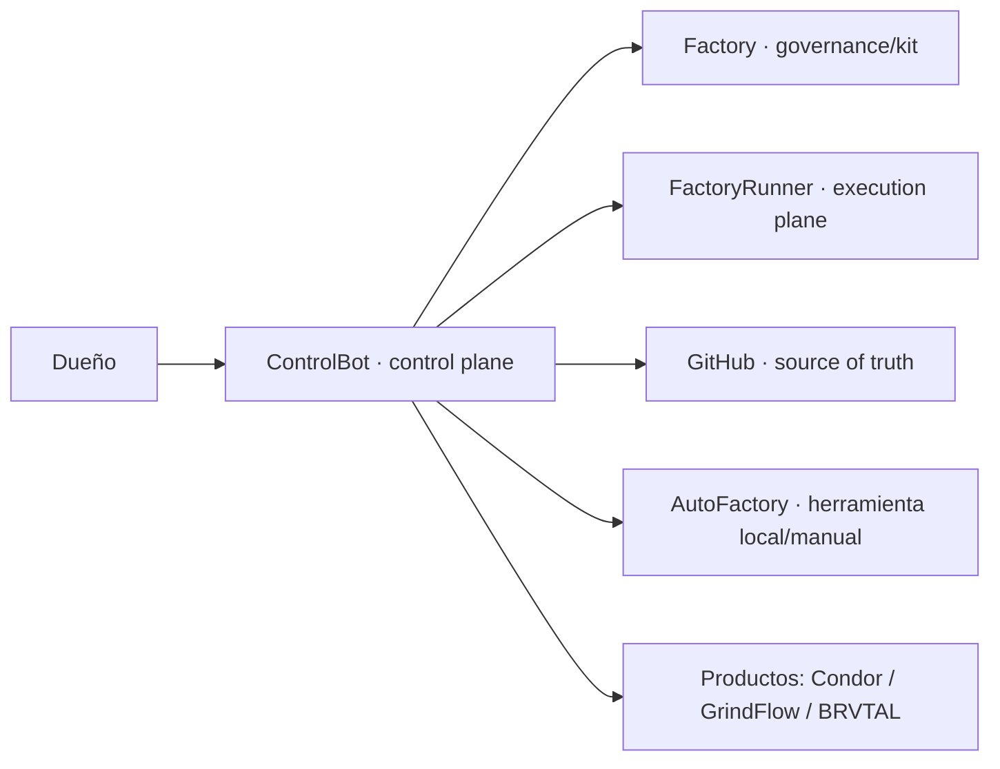

# ControlBot

> Centro de control web **privado** de la fábrica de software asistida por IA.

**Rol en la fábrica:** control plane privado · **Fase:** construcción · **Roadmap:** [épico canónico #1](https://github.com/pl0n3r/ControlBot/issues/1)

ControlBot mantiene el modelo operativo de proyectos, agentes, trabajo, decisiones, producción e incidentes. Factory aporta gobernanza; GitHub conserva la fuente de verdad del ciclo de código; FactoryRunner ejecuta trabajo autorizado y AutoFactory sigue como herramienta local/manual separada.

## Operational Cockpit

<!-- factory:status:start -->
| Señal | Estado |
| --- | --- |
| main SHA | UNKNOWN |
| versión | UNKNOWN |
| CI | UNKNOWN |
| release | UNKNOWN |
| health | UNKNOWN |
| smoke/observer | UNKNOWN |
| quality/security | UNKNOWN |
| Issue activo | UNKNOWN |
| PR activo | UNKNOWN |
| último release | UNKNOWN |
<!-- factory:status:end -->

### Progress + Readiness

<!-- factory:progress-readiness:start -->
| Señal | Estado |
| --- | --- |
| Target | UNKNOWN |
| Progress | UNKNOWN |
| Readiness | UNKNOWN |
| Evidence freshness | UNKNOWN |
| Critical blockers | UNKNOWN |
| Trend | UNKNOWN |

| Dimensión | Progress | Readiness |
| --- | --- | --- |
| UNKNOWN | UNKNOWN | UNKNOWN |
<!-- factory:progress-readiness:end -->

> Estos bloques son derivados. `UNKNOWN`/`PENDING` significa que falta evidencia canónica; nunca se promueve a `GREEN` o `DEGRADED` sin evidencia.

## Work Queue

- **NOW:** [trabajo reservado/en curso](https://github.com/pl0n3r/ControlBot/issues?q=is%3Aissue+is%3Aopen+label%3A%22estado%3A+reservado%22).
- **NEXT:** [Issues críticos disponibles](https://github.com/pl0n3r/ControlBot/issues?q=is%3Aissue+is%3Aopen+label%3A%22prioridad%3A+cr%C3%ADtica%22+label%3A%22estado%3A+disponible%22).
- **LATER:** [épico y planificación canónica #1](https://github.com/pl0n3r/ControlBot/issues/1).
- **BLOCKED:** [bloqueos vigentes](https://github.com/pl0n3r/ControlBot/issues?q=is%3Aissue+is%3Aopen+label%3A%22estado%3A+bloqueado%22).

Esta vista resume la cola; no reemplaza el épico, los Issues, las decisiones ni el historial de releases.

## Qué hace el producto

ControlBot es el sistema operativo privado de la fábrica. Centraliza:

- dashboard de producción, trabajo, seguridad y costos;
- proyectos, agentes, sesiones y capacidad;
- despacho y seguimiento de trabajo;
- decisiones del dueño e inbox de puertas humanas;
- observabilidad, incidentes y bitácora;
- integraciones gobernadas con GitHub, FactoryRunner y el puente de navegador.

El acceso es solo del dueño. Las capacidades sensibles permanecen detrás de autenticación fuerte, policy y trazabilidad.

## Arquitectura en 60 segundos



ControlBot decide y coordina dentro de su autoridad; no reemplaza los contratos de Factory, no ejecuta trabajo arbitrario por shell y no fusiona datos ni código con los productos.

## Stack e infraestructura

**Stack declarado:** PHP 8.5 + MariaDB + GitHub Actions + Hostinger shared hosting.

- app, base de datos y deploy propios;
- sin procesos Node permanentes ni WebSockets en hosting compartido;
- tareas periódicas por cron cuando correspondan;
- tokens y secretos solo server-side;
- deploy y observación permanecen fail-closed hasta contar con configuración explícita.

## Ciclo de entrega

Issue → `/tomar` → rama canónica → implementación → PR → Factory CI/aceptación/revisión → merge → release/deploy cuando aplique → smoke/observer → evidencia.

Un merge no equivale a go-live ni a producción validada. Las acciones de infraestructura respetan backup, rollback, trazabilidad y puertas humanas vigentes.

## Calidad y seguridad

- Factory v1 gobierna CI, coordinación, aceptación, roles, etiquetas, release, política y privacidad.
- Estado desconocido falla cerrado; no se inventan señales operativas.
- Acceso del dueño con autenticación fuerte, CSRF, rate limiting y sesiones cortas.
- Tokens de GitHub/Sentry y credenciales viven fuera del repositorio.
- La API del puente acepta llaves por perfil emparejadas y revocables.
- Login, captcha y verificaciones de cuentas web los realiza manualmente el dueño.
- Toda acción relevante deja bitácora y las escrituras de infraestructura siguen `decisiones.yml`.

## Roadmap y fuentes de verdad

- **Visión y roadmap:** [Issue #1](https://github.com/pl0n3r/ControlBot/issues/1)
- **Contrato local:** [`AGENTES.md`](AGENTES.md)
- **Decisiones del dueño:** [`decisiones.yml`](decisiones.yml)
- **Tratamientos y fase:** [`datos.yml`](datos.yml)
- **Trabajo ejecutable:** [GitHub Issues](https://github.com/pl0n3r/ControlBot/issues)
- **Cambios revisados:** [Pull Requests](https://github.com/pl0n3r/ControlBot/pulls)
- **Contratos profundos:** [`docs/`](docs/)
- **Gobernanza común:** [`pl0n3r/factory@v1`](https://github.com/pl0n3r/factory/tree/v1)

El README enlaza estas fuentes; no las sustituye ni crea un roadmap paralelo.

## Desarrollo local

El repositorio usa regresiones Python que ejercitan contratos y escenarios PHP. La validación reproducible principal es:

```bash
python3 -m unittest discover -s tests -p 'test_*.py'
```

Los escenarios PHP requieren PHP 8.5, la misma versión fijada por CI.

## Mapa de la fábrica

- **Factory:** governance/kit y contratos compartidos.
- **ControlBot:** control plane privado de orquestación, decisiones, observabilidad y UX del dueño.
- **FactoryRunner:** execution plane autónomo que materializa órdenes autorizadas.
- **AutoFactory:** herramienta local/manual y puente externo estable; no es el scheduler de ControlBot.
- **Condor / GrindFlow / BRVTAL:** productos independientes con sus propios datos, runtime y deploy.

La elegibilidad en la cola automática no altera estas responsabilidades.

## Inbox de decisiones

El inbox descubre puertas humanas abiertas y confiables en los repos configurados, recorre Issues con paginación acotada y falla cerrado si no puede completar la lectura. Para `factory-release`, conserva SHA exacto de `main`, checks y evidencia antes de permitir una acción.

## Runtime privado de decisiones

El runtime resuelve las acciones del dueño desde contexto server-side, inyecta CSRF, conserva correlación de release y delega mutaciones solo a adapters gobernados. No convierte el dashboard en una cabina pública ni amplía la autoridad del agente.

## Historial y bitácora

ControlBot reutiliza una bitácora append-only para exponer historial privado por decisión y filtros server-side. La salida minimiza datos, conserva evidencia HTTPS allowlisted y mantiene prioridad para puertas que bloquean producción o trabajo.
